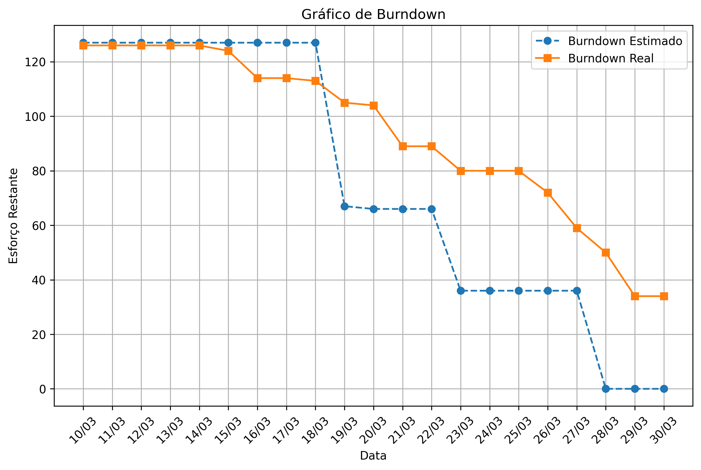

<h1 align="center">Sumário</h1>

  <a href ="#busts_in_silhouette-integrantes-da-equipe"> Integrantes da Equipe </a>  •
  <a href ="#pushpin-projeto-api"> Projeto API </a>  •
  <a href="#hammer_and_wrench-produto"> Produto </a> •
  <a href="#computer-tecnologias-utilizadas"> Tecnologias Utilizadas </a> •
  <a href="#gear-configurar-o-ambiente"> Configurar o Ambiente </a> •
  <a href ="#triangular_ruler-wireframe-do-produto"> Wireframe do Produto </a>  •
  <a href="#white_check_mark-requisitos"> Requisitos </a> •
  <a href="#card_file_box-backlog-do-produto"> Backlog do Produto </a> •
  <a href="#calendar-backlog-das-sprints"> Backlog das Sprints </a>

<h1>:busts_in_silhouette: Integrantes da Equipe</h1>

| Integrantes | Redes Sociais |
|-------------|---------------|
| Naira Maximo - Product Owner |   |
| Ruth Mira - Scrum Master |   |
| Alexandre Jonas - Developer |   |
| Carla Daiane - Developer  |   |
| João Pedro - Developer |   |
| João Arruda - Developer |   |
| Pablo Henrique - Developer |   |
| Renato Mendes - Developer|   |
| Vitor Morais - Developer |   |

[Arquivo de Contribuição do Projeto](https://github.com/PorygonAPI/doc/blob/main/CONTRIBUTING.md)

<h1>:pushpin: Projeto API</h1> 

<h2>:memo: Tema</h2>

Manipulação de dados armazenados em banco relacional com visualização em tela e / ou 
acesso por meio de API

### :dart: Objetivos
> - API Application Programming Interface (Interface de Programação de Aplicação) 
> - Criação de APIs RESTful
> - Injeção de Dependências e Arquitetura Modular
> - Gerenciamento de Banco de Dados com JPA/Hibernate 
> - Segurança com Spring Security 
> - Aprofundamento no conhecimento de banco de dados relacional por meio de tarefas de administração
> - Programação de backend em banco de dados utilizando PL/SQL do Oracle
> -  Componentização e Reutilização de Código
> - Gerenciamento de Estado com Vue
> - Manipulação e Visualização de Dados em Tempo Real
> - Diretivas Personalizadas e Renderização Condicional:

### :mag: Tríade da API
> - Laboratório de Desenvolvimento em BD IV
> - Programação Avançada em BD
> - Administração de BD

### :hourglass_flowing_sand: Prazos
- [x] 24/02 a 28/02 - Kick-off
- [x] 10/03 a 30/03 - Primeira Sprint
- [ ] 31/03 a 04/04- Sprint Review / Planning
- [ ] 07/04 a 27/04 - Segunda Sprint
- [ ] 28/04 a 02/05 - Sprint Review / Planning
- [ ] 05/05 a 25/05 - Terceira Sprint
- [ ] 26/05 a 28/05 - Sprint Review 
- [ ] 09/05 - Feira de Soluções e Apresentação Final API

*****

## :hammer_and_wrench: Produto</h1>

### :computer: Tecnologias Utilizadas
- **Java 22**
- **Spring Boot 3.3.3**
  - Spring Data JPA
  - Spring Web
  - Spring DevTools
- **MySQL**
- **Docker**
- **Vue**

## :gear: Configurar o Ambiente 

Para instalar e configurar os ambientes e demais informações importantes para a utilização do sistema, consulte o [Arquivo de Teste](https://github.com/PorygonAPI/doc/blob/main/TEST.md).

### :triangular_ruler: Wireframe do Produto
Wireframe do produto disponível pelo [Figma](https://www.figma.com/design/Q9tJCNQQ7dv0PEZaXabBM7/4%C2%BA-SEMESTRE---VISIONA?node-id=0-1&t=qaJCB8RqM4oV9k2V-1)

### :game_die: Banco de Dados

[Modelo Físico]()
  
## :white_check_mark: Requisitos

### Requisitos Funcionais:

| Código | Requisito Funcional |
|--------|---------------------|
| R1 | Três tipos de usuários: administrador, analista e consultor |
| R2 | Analista irá visualizar informações da área bem como aprovar ou não a área cadastrada no sistema. Caso a área não seja aprovada, editá-la e atualizá-la no banco |
| R3 | Consultor terá acesso aos dashboards, mapa e poderá fazer o cadastro de área no sistema |
| R4 | Administrador poderá realizar as mesmas funções que o Consultor e o Analista, além do cadastro de usuários |
| R5 | Cadastro de geometria via upload de arquivo .geojson |
| R6 | Para o cadastro deve ser informado nome da fazenda, cultura (exemplo: soja, milho...), produtividade por ano, área, tipo de solo, cidade e estado |
| R7 | Dashboards deverão apresentar informações a partir de filtros dos dados e destacar no mapa as áreas resultantes |

### Requisitos Não Funcionais:  

| Código | Requisito Não Funcional |
|--------|-------------------------|
| RN1 | Ferramenta de desenho para edição de geometria |

### :card_file_box: Backlog do Produto

| Ranking | Prioridade | User Story | Sprint | Requisitos    |
|---------|------------|------------|--------|---------------|
| 1 | Alta | Como administrador, preciso cadastrar novos usuários (analistas e consultores) para que possam acessar e operar o sistema com determinadas permissões | 1 | R1 e R4 |
| 2.1 | Alta | Como consultor, eu quero poder cadastrar áreas agrícolas para que, posteriormente, os analistas possam verificar e corrigir os vetores das áreas | 1 | R3, R4, R5 e R6 | 
| 2.2 | Alta | Como analista, eu preciso visualizar e editar as áreas cadastradas para garantir a precisão das informações | 2 | R2 e R4 |
| 3 | Média| Como analista, eu preciso comparar imagens de diferentes momentos (antes e depois de ajustes) para garantir que os dados estão corretos | 2 | R2 e R4 |
| 4 | Média| Como consultor, eu quero acessar dashboards para acompanhar as atividades dos analistas, progresso de análise e cadastramento das áreas | 3 | R4 e R7 |
| 5 | Baixa| Como administrador, preciso que a aplicação seja segura e todos os dados sensíveis estejam protegidos, tendo as permissões e acessos apenas quem eu configurar no cadastro | 3 | R2, R3, R4 e R7 |

### :calendar: Backlog das Sprints

 SPRINT 1 

### Vídeo da aplicação e suas funcionalidades:

### **1** - User Story - Cadastro - *R1 e R4*
Como administrador, preciso cadastrar novos usuários (analistas e consultores) para que possam acessar e operar o sistema com determinadas permissões.
### Critérios de Aceite:   
- O Administrador consegue cadastrar, editar e excluir usuários.
-	Os dados para cadastro são nome completo, e-mail, senha e cargo. O login será feito por meio de e-mail e senha.
-	Usuários autenticados com diferentes permissões só acessam funções específicas e o Administrador possuirá acesso a todas as funções.

### **2.1** - Cadastro de Áreas Agrícolas - *R3, R4, R5 e R6*
Como consultor, eu quero poder cadastrar áreas agrícolas para que, posteriormente, os analistas possam verificar e corrigir os vetores das áreas. 
### Critérios de Aceite:   
-	O Consultor consegue cadastrar novas áreas com informações completas e fazer upload de .geojson. (Validar após recebimento dos arquivos)
-	O cadastro de áreas precisa das seguintes informações: nome da fazenda, cultura, produtividade por ano, área, tipo de solo, cidade e estado.
-	O sistema salva as alterações e atualiza o banco de dados corretamente.

Visualizar o [Wireframe da Sprint 1]()

 SPRINT 2 

### Vídeo da aplicação e suas funcionalidades:
<!-- https://github.com/user-attachments/assets/ecf9a2c3-bc68-442f-a9ba-4b01d428d3ce -->

### **2.2** - Visualização e Edição - *R2 e R4*
Como analista, eu preciso visualizar e editar as áreas cadastradas para garantir a precisão das informações. 
### Critérios de Aceite:   
-	O Analista visualiza, edita e aprova os vetores das áreas cadastradas no sistema.
-	O tempo gasto nas edições dos vetores precisa ser armazenado para a visualização do próprio analista e servir de parâmetro no Dashboard.
-	O sistema salva as alterações e atualiza o banco de dados corretamente, mantendo o vetor inicial para comparação.

### **3** - Edição e Análise de Imagens - *R2 e R4*
Como analista, eu preciso comparar imagens de diferentes momentos (antes e depois de ajustes) para garantir que os dados estão corretos. 
### Critérios de Aceite:   
-	O analista consegue visualizar e comparar imagens antigas e novas de uma área.
-	Correções e anotações podem ser salvas.
-	Dados corrigidos são armazenados no banco de dados e ficam disponíveis para consulta.

<!-- Visualizar o [Wireframe da Sprint 2](doc/images/wireframe2.png). -->

 SPRINT 3 

### Vídeo da aplicação e suas funcionalidades:
<!-- https://github.com/user-attachments/assets/94cbb601-29eb-468a-8204-dc4a2566c86d -->

### **4** - Dashboards e Relatórios - *R4 e R7*
Como consultor, eu quero acessar dashboards para acompanhar as atividades dos analistas, progresso de análise e cadastramento das áreas. 
### Critérios de Aceite:   
-	O consultor e o administrador visualizam o progresso das análises em gráficos interativos.
-	Filtros permitem visualizar dados específicos (áreas analisadas, status de aprovação, prazos de entrega).
-	Os dashboards são atualizados em tempo real com base nas atividades dos analistas.

### **5** - Integração e Segurança - *R2, R3, R4 e R7*
Como administrador, preciso que a aplicação seja segura e todos os dados sensíveis estejam protegidos, tendo as permissões e acessos apenas quem eu configurar no cadastro. 
### Critérios de Aceite:   
-	Apenas usuários autenticados acessam a plataforma.
-	O sistema mantém logs de atividades (login, alterações de dados, aprovações).
-	Dados sensíveis estão protegidos conforme os padrões de segurança.

<!-- Visualizar o [Wireframe da Sprint 3](doc/images/wireframe3.png). -->

**Acesse a documentação de Contribuição do Projeto no arquivo [CONTRIBUTING](https://github.com/PorygonAPI/doc/blob/main/CONTRIBUTING.md)**

## 🚀 Desempenho da Equipe | Burndown

 SPRINT 1 | 

 

Nesta sprint, organizamos os prazos em três ciclos de seis dias. As tarefas foram classificadas por prioridade: alta, média e baixa.
 

Última Atualização: 30/03/2025

 SPRINT 2 | 

 

  <!-- Nesta sprint, usamos usando points por histórias para medir nosso progresso em relação às entregas propostas.  
  Pontuação total: 29 -->
 

<!-- 

Última Atualização: 01/10/2024 -->

 SPRINT 3 | 

 

  <!-- Nesta sprint, usamos usando points por histórias para medir nosso progresso em relação às entregas propostas.  
  Pontuação total: 29 -->
 

<!-- 

Última Atualização: 01/10/2024 -->

